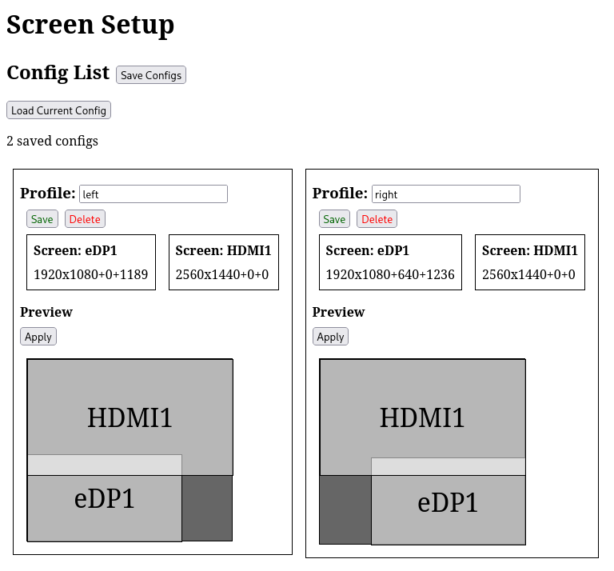

# screen-setup

Setup screens position from saved profiles

[](https://www.npmjs.com/package/screen-setup)



## Installation

```bash
npm install screen-setup
```

## Usage

```bash
npx screen-setup-server
```

Sample output:

```
listening on http://localhost:8456
listening on http://127.0.0.1:8456 (lo)
listening on http://192.168.80.98:8456 (wlp3s0)
```
